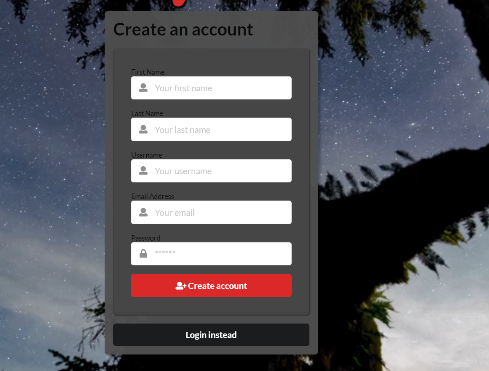
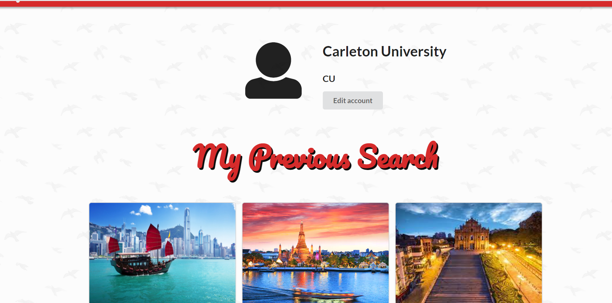
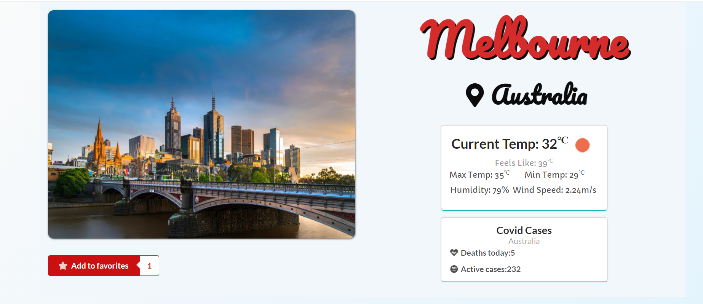

<h1 align = "center"> 


</h1>
 <h2 align = "center">Travellers Guide</h2>

<p align = "center">
  
  
  
  
  
  
  
  
  
                                                                              
</p>

## 🎯 Deployed App

### [explorer-guide.herokuapp.com](https://explorer-guide.herokuapp.com/) 

[](https://explorer-guide.herokuapp.com/)
 
## ☀️ About:
Explorer has been created to help finalize your next travel destination. Finding your dream location has never been so easy... \
You merely need to log in or sign up, create your profile, answer a few questions, and then you are good to go. It happens that at times you like more than one place, to tackle such a situation you also have the option of saving cities of your choice and finalizing a place later from your saved list. \
If this sounds exhausting, then you can also get a randomly generated city where you can plan for a holiday with your near and dear ones.
 
## 📓 Description:

* A full stack user-focused `MERN` application that works with real-world data to solve a real-world challenge, with a focus on data and user demand.
* Used a framework that was both easy-to use, but also responsive and optimize for the user’s experience.
* The app has mainly been styled by using `React Semantic UI` CSS framework and was hosted using `Heroku`.
* The steps were mostly focused on creating a good UI/UX and with the logic of interactions around the page.
* Using `Apollo Client` with GraphQL was also some of our main focused areas.
 
## 🔧 Usage:
 * Everything is starting from the `Landing Page`, where you can navigate to either the `login` or the `signup` page.
 * Once logged in, the user is presented with the `Home Page`, where they can discover some functionality around the app & navigate to their `Account Page` or simply `Logout`
 * The `Explorer Top 10` cities & selecting a continent could also be navigated through the static side selector.
 * Selecting the `pick an option for me` button will navigate you to the __set of questions__ that will provide suitable results to the user.
 * Selecting a city card would navigate you to a page where you are provided with the __details__ about the city that includes its __location__,  a __video__ quick tour about the area and at the bottom a list of __hotels__ & most **popular attractions** that are available will be present.
 * The user can also view the total number of __daily active COVID-19 cases__ in that country.
 * You can add a city yo your __Favorites__ and view it later.
 * On clicking the `Account page`, the user can update their details and also view the city history of their account.

## 🔩 Installation:
`Explorer` could also be running in your local computer, however, I wouldn't recommend it since you would be needing an `API KEY` from all the API's there were present. Althought, if attempting to do so, please enter your `API KEY` in a `.env` file and store it under `/client/src` then follow the following.
```env
REACT_APP_API_KEY = <YOUR_API_KEY_HERE>
REACT_APP_API_KEY_YELP = <YOUR_API_KEY_HERE>
REACT_APP_API_KEY_MAP = <YOUR_API_KEY_HERE>
```
After those steps, simply pull this repository and run;
```bash
npm install
```
on the root of the directory.
> This will install the packages for both the client and the server.
> Also make sure your mongoDB connection is valid since the local program uses data which is stored locally.
> Check with simply `mongod` or `mongo`. 
After installing the dependencies, run;
```bash
npm run dev
```
to start the application on `http://localhost:3000`.

## 🧰 Dependencies and Tools:

 _Client Side_
 ```json
 "dependencies": {
    "@apollo/client": "^3.3.5",
    "@testing-library/jest-dom": "^5.11.4",
    "@testing-library/react": "^11.1.0",
    "@testing-library/user-event": "^12.1.10",
    "google-maps-react": "^2.0.6",
    "graphql": "^15.4.0",
    "jwt-decode": "^3.1.2",
    "pexels": "^1.2.1",
    "query-string": "^7.0.1",
    "react": "^17.0.1",
    "react-dom": "^17.0.1",
    "react-router-dom": "^5.2.0",
    "react-scripts": "4.0.1",
    "react-toasts": "^3.0.6",
    "semantic-ui-css": "^2.4.1",
    "semantic-ui-react": "^2.0.3",
    "web-vitals": "^0.2.4"
  },
 
```

_Server Side_

 ```json
 "dependencies": {
    "apollo-server-express": "^2.12.0",
    "bcrypt": "^5.0.0",
    "express": "^4.17.1",
    "graphql": "^15.5.1",
    "jsonwebtoken": "^8.5.1",
    "mongoose": "^5.9.9",
    "query-string": "^7.0.1"
  },
  "devDependencies": {
    "nodemon": "^2.0.3"
  }
  ```

 _Root Directory Scripts_
 ```json
"scripts": {
   "start": "node server/server.js",
   "dev": "concurrently \"cd server && npm run watch\" \"cd client && npm start\"",
   "install": "cd server && npm i && cd ../client && npm i",
   "seed": "cd server && npm run seed",
   "build": "cd client && npm run build"
 }

```
 
 **API KEYS**
 
REACT_APP_API_KEY = [Open Weather Map API](https://openweathermap.org/) \
REACT_APP_API_KEY_YELP = [YELP API](https://www.yelp.ca/developers/documentation/v3/get_started) \
REACT_APP_API_KEY_MAP = [Google Maps API](https://developers.google.com/maps) 

  
## 🌄Snapshots 

Landing Page                   |
:-------------------------:   |
      |


 Login                    |Signup
:-------------------------:   |:-------------------------:
      |

Home Page                 |   Profile Page
:-------------------------:   |:-------------------------:
      |

My Search Results                |   Selected City
:-------------------------:   |:-------------------------:
      |


## 🧭 Future Goals

1. Use a web manifest
2. Uses a service worker for offline functionality so that the app works as a PWA
3. Add forgot password/reset password as a feature

## 📮 Issues:
If any issues or bugs are present, please submit a ticket to the `Issues` tab or contact us via explorer.guide.me@gmail.com, and we will get back to it as soon as possible.


## 📊 Notes & Improvements:

> Creating Explorer was very enjoyable and fun since the mood of the application is based on vacation and travelling, we all acted very cool and stress-free. Although, creating this app was a last minute change in the middle of the **2-week** duration **Final Project Assignment**, we were able to work collaboratively and well organized together as a team.

> Explorer would an awesome place to start and grow this idea of a `traveller's search place` over the time, however, certain functionality could've been added between users between each other to make this idea much more enjoyable through UX.


> We are looking to eventually add more into it however, if you've got unique ideas please let us know, we would love to hear them.


## Meet the Team 


 
[Todd Kelly](https://github.com/ToddKelly)
<p align="left">
       
 </p>
 
[Colleen Collins](https://github.com/ColleenCollins8)
<p align="left">
       
</p>

 [Dipti Razdan](https://github.com/Dipti2021)
  <p align="left">
       
 </p>
  
[Ashton Headley](https://github.com/ashiemotto)
<p align="left">
       
 </p>

 [Kemal Demirgil](https://github.com/kemaldemirgil)
  <p align="left">
       
 </p>


## ©️ License:
Copyright © DACK. All rights reserved.
Licensed under the [MIT](https://github.com/DACK-OF-ALL-TRADES/explorer/blob/main/LICENSE) license.
